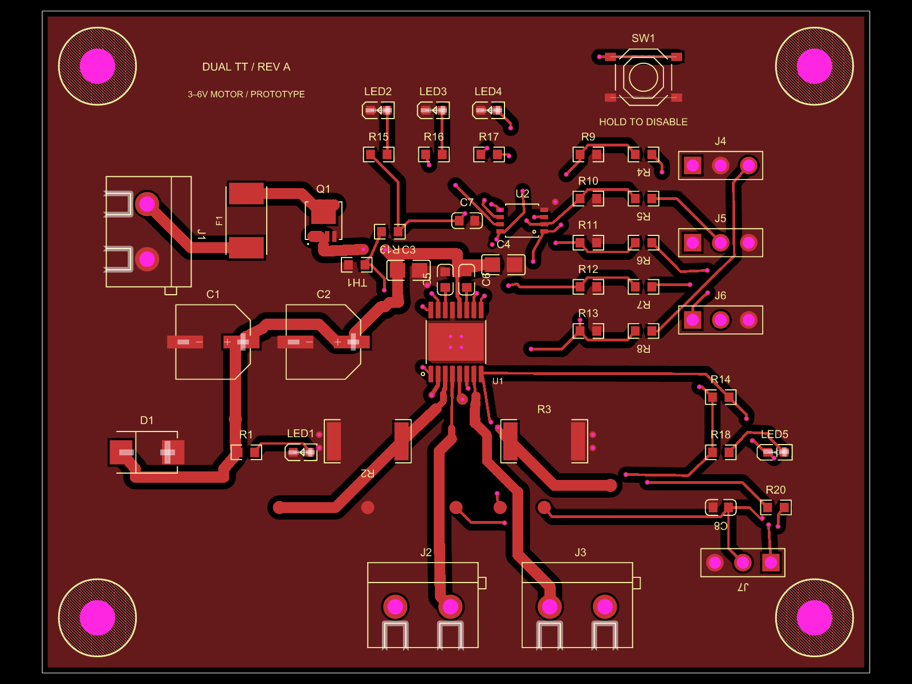

# DRV8833 dual TT motor driver, 3–6 V — routed prototype

[Public PCB](https://tscircuit.com/AnasSarkiz/drv8833-dual-tt-motor-driver-3-6v#pcb) · [GitHub repository](https://github.com/AnasSarkiz/drv8833-dual-tt-motor-driver-3-6v)

Revision A; package 0.1.0-alpha.6. **Routing is complete; physical qualification for fabrication and sale is still pending.** Native netlist and placement checks, full schema validation and fresh native routing checks pass. See [VALIDATION.md](VALIDATION.md) for evidence and remaining classified warnings.

**Prototype order packet:** [Layout/export fixes completed; final quote and manufacturer preview remain](ORDER_READINESS.md). [Current stock for five boards](artifacts/order-release/STOCK.md).

A four-layer driver module for two brushed TT motors, controlled by an external host. The [reference TT motor](https://www.adafruit.com/product/3777) mounts to the chassis separately. This PCB is **75 × 60 × 1.6 mm**, with four **3.2 mm non-plated M3 holes on 65 × 50 mm centers** and 7 mm hardware keepouts. It is a generic module with a custom mounting pattern; compatibility with a particular chassis is not claimed. [Dimensioned mounting template](artifacts/routed/mounting-template.svg).

Minimum via drill **0.30 mm**, minimum via pad **0.45 mm**. The final board has 72 trace records, 60 through vias and ground pours on top, inner1 and bottom. Inner1 also carries signal routes. The four vias under U1 are thermal vias connected to ground, not mounting posts. [Routing details and layer previews](ROUTING_REVIEW.md).

The design has 47 purchased parts, 23 imported part types, five LEDs, seven bare test pads, separate A/B shunts and an NTC divider. The input target is **3–6 V at J1 including supply tolerance**. Nominal current chopping is about 1.33 A/channel; neither this nor the 1 A/channel continuous objective is a verified board rating. Hot-path voltage loss, regenerative spikes and thermal performance need bench testing. F1 is a non-resettable 3 A fuse; diagnose the fault before replacement. [Electrical review](DESIGN_REVIEW.md).

**SW1 — HOLD TO DISABLE:** hold the button to disable both motor outputs and let the motors coast. Release returns control to the host and can restart motion. It does not disconnect board power. [Button design and operating details](BUTTON_REVIEW.md).

## Connector pinout

All pin numbers are component pin numbers. Header geometry and assembly orientation remain under review.

| Connector | Pin 1 | Pin 2 | Pin 3 |
|---|---|---|---|
| J1 input | VIN | GND | — |
| J2 motor A | AOUT1 | AOUT2 | — |
| J3 motor B | BOUT1 | BOUT2 | — |
| J4 host power/enable | VIO input | GND | ENABLE / nSLEEP |
| J5 channel A | AIN1 | AIN2 | GND |
| J6 channel B | BIN1 | BIN2 | GND |
| J7 diagnostics | FAULT_N | TEMP | GND |

VIO is supplied by the host: match 3.3 V logic with 3.3 V VIO, or 5 V logic with 5 V VIO. It is not a power output. Mixed-voltage configurations are not approved. Pull-downs hold all commands and ENABLE low with disconnected high-impedance host pins. The host must drive ENABLE low before initialization, set commands to coast, then enable and wait at least 1 ms before PWM. Use command inputs for speed PWM, not nSLEEP. Both inputs low request coast, unequal inputs request drive, both high request brake; direction depends on motor wiring. All timing and sequencing require prototype confirmation.

LED1 indicates protected VM; LED2 VIO; LED3/4 unequal A/B commands (they can light while the driver sleeps); LED5 asserted fault. No LED measures rotation. TEMP measures local board temperature, not motor winding or silicon junction temperature. Its revised 56 kΩ/10 kΩ divider gives TEMP≈0.1515×VIO at 25°C; it is not an automatic cutoff. TP1/2 expose raw switching sense nodes, not calibrated ADC current telemetry. TP3 is GND; TP4 VM; TP5 VIO; TP6 FAULT_N; TP7 TEMP.

## Reproduce and inspect

Run `bun install --frozen-lockfile`, `bun run format:check`, `bun run typecheck`, `bun run build`, then `bun test`. `bun run render` regenerates the layer and schematic previews. Build validates the real generated output and checks physical routing; it does not patch Circuit JSON or suppress errors. The saved routes are editable native TSX route paths with validated component anchors.

Three unpublished, source-patched toolchain packages are included in `vendor/`, with exact upstream bases, regression tests and patches in [references/toolchain-fixes](references/toolchain-fixes/README.md). See [TOOLCHAIN.md](TOOLCHAIN.md).

- [BOM](BOM.md), [imports](IMPORTS.md), [placement](PLACEMENT_REVIEW.md) and [mechanical dimensions](MECHANICAL.md)
- [Validation](VALIDATION.md), [routing status](ROUTING_GATE.md) and [tool limitations](ISSUES.md)
- [Assembly review](ASSEMBLY_PLAN.md) and [physical test plan](TEST_PLAN.md)
- [Working reference comparison](REFERENCE_BOARD_REVIEW.md)
- [Public repository and registry receipts](PUBLICATION.md)

Earlier `artifacts/pre-route/` files are historical and are superseded by `artifacts/routed/`. No manufacturing order has been placed.

