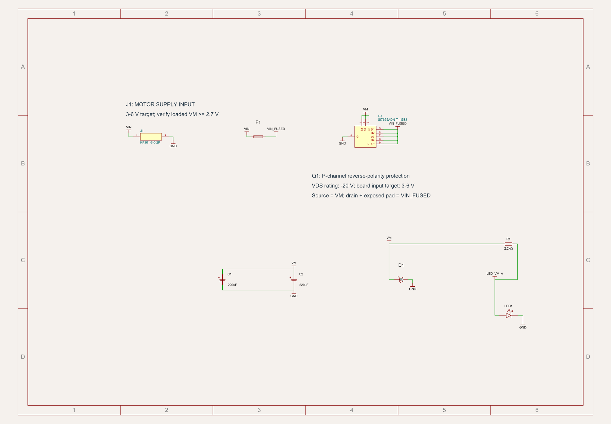
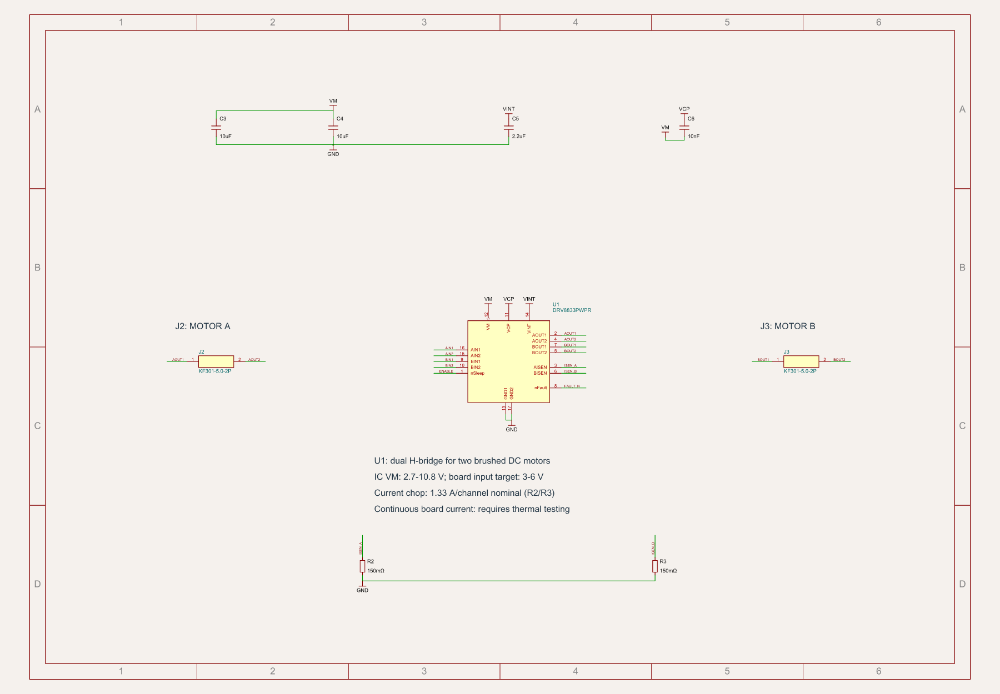
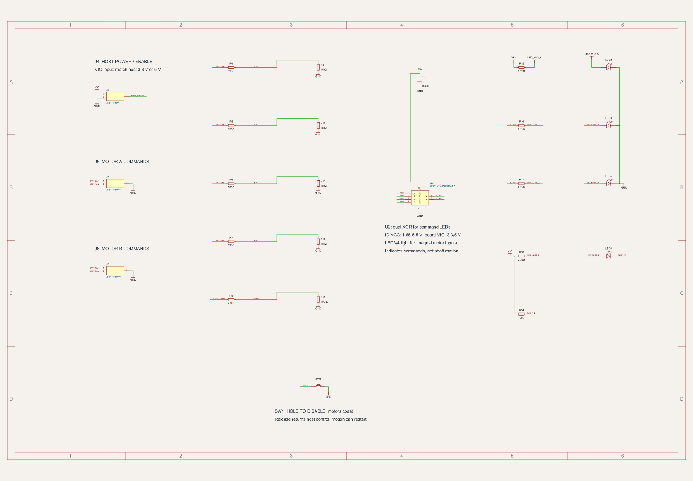
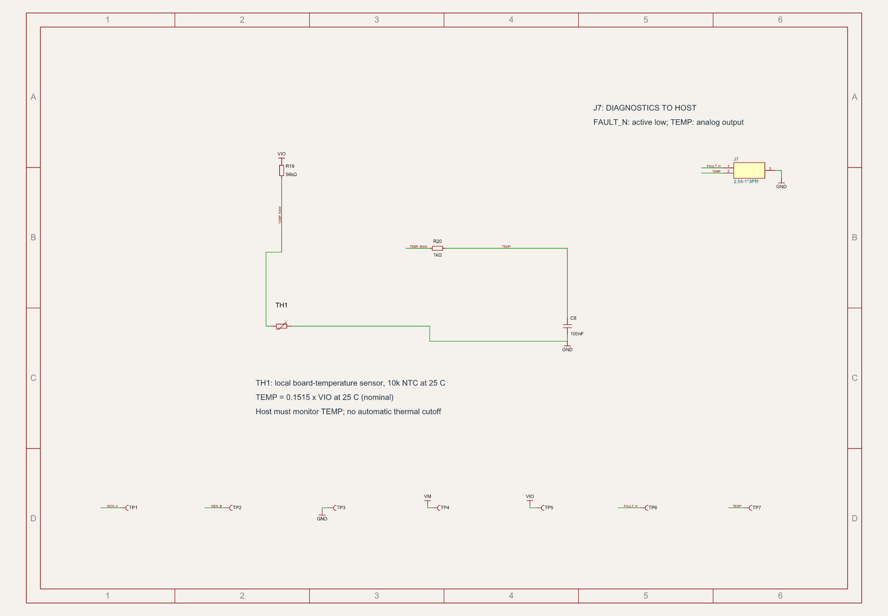

# Schematic design review — alpha.7

Reviewed 29 September 2026. The four sheets now include native `<schematictext>` notes beside every chip: U1, U2 and the chip-style Q1 symbol. Labels also identify all connectors, the disable button and the temperature measurement.

| Part | Nearby explanation |
|---|---|
| U1 DRV8833 | Two brushed-DC motor bridges; IC VM range 2.7–10.8 V, board input target 3–6 V, nominal 1.33 A/channel current chopping; continuous current requires thermal testing |
| U2 SN74LVC2G86 | Dual XOR for command LEDs; IC VCC range 1.65–5.5 V, board VIO 3.3/5 V; indication measures commands rather than rotation |
| Q1 SI7655ADN | P-channel reverse-polarity protection, −20 V VDS rating and source/drain/exposed-pad connections |

Ratings were checked against the [TI DRV8833 datasheet](https://www.ti.com/lit/ds/symlink/drv8833.pdf), [TI SN74LVC2G86 datasheet](https://www.ti.com/lit/ds/symlink/sn74lvc2g86.pdf) and [Vishay SI7655ADN datasheet](https://www.vishay.com/docs/62909/si7655adn.pdf). IC limits are distinct from the board's intended supply and unqualified continuous-current target.

Host headers and input networks use separate schematic sections to replace obstructing ground wires with labeled connections. Diagnostic test pads are likewise separated from J7. Notes have consistent font size and line spacing, remain inside their sheets and were visually checked against wires, symbols and labels in all four regenerated previews. Native schematic-placement checks report no collision or overlap findings. Remaining box-padding and orientation suggestions are non-blocking style heuristics, retained without suppression.

The build, full schema guard, native netlist, mechanical checks and native routing checks pass. Placement DRC reports zero errors and warnings, with the existing advisory C7 orientation suggestion. All 27 board tests pass with the same 1,139 assertions; the independent drill and pad rejection cases now run separately, each retaining the default runner deadline and full validation.

All 1,000 PCB records, 54 CAD records and electrical component/port/net/trace records exactly match alpha.6. Every file in the alpha.6 order-release directory is unchanged. [Comparison evidence](artifacts/schematic-review/unchanged-hardware.json) and [check logs](artifacts/schematic-review/logs/). The schematic update adds no hardware or manufacturing qualification.

## Rendered sheets

